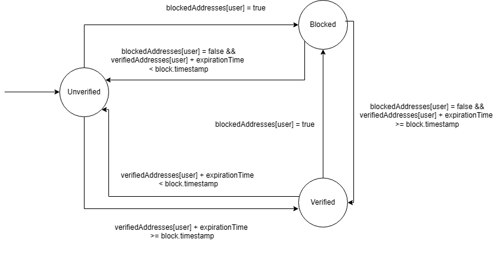

# Modified ERC20 token

Author: Adam Vožda (xvozdaa00)

## Table of Contents

1. [Table of contents](#table-of-contents)
2. [Project summary](#project-summary)
3. [Setup instructions](#setup-instructions)
   - [Prerequisites](#prerequisites)
   - [Quick Start (Using Makefile)](#quick-start-using-makefile)
   - [Manual Setup](#manual-setup)
4. [Technology Stack](#technology-stack)
   - [Smart Contracts](#smart-contracts)
   - [Frontend](#frontend)
5. [Project Structure](#project-structure)
6. [Smart Contracts](#smart-contracts)
7. [Frontend (dApp)](#frontend-dApp)
8. [Implementation Details](#implementation-details)
   - [Identity Verification and expiration](#identity-verification-and-expiration)
   - [Adming Voting](#adming-voting)
   - [Daily Limit Reset Implementation](#daily-limit-reset-implementation)
9. [Slither Analysis](#slither-analysis)
10. [Testing Approach](#testing-approach)
11. [License](#license)

## Project Summary

This project implements an enhanced ERC20 token with max supply, identity verification, transfer restrictions, and multi-role administration systems. It consists of a smart contract backend written in Solidity and a frontend application built with React and Wagmi.

## Setup Instructions

### Prerequisites

Before getting started, ensure you have the following installed:

- **Node.js** (v18 or later)
- **Foundry** - Ethereum development framework
- **Git** - Version control system

### Quick Start (Using Makefile)

1. Start local blockchain network:

```bash
make network
```

2. In a new terminal, deploy the smart contract:

```bash
make deploy
```

3. Start the frontend development server:

```bash
make dapp
```

4. Run tests (optional):

```bash
make test
```

### Manual Setup

#### Smart Contract

1. Navigate to the smart-contracts directory:

```bash
cd smart-contracts
```

3. Install dependencies:

```bash
forge install
```

4. Run a local blockchain:

```bash
anvil --mnemonic "test test test test test test test test test test test junk"
```

It is recommended to use the same mnemonic for all deployments so that the prefilled addresses are always the same. Admin addresses can be modified in `./script/DeployBDAERC20.s.sol` file.

5. Deploy the contract:

```bash
forge script script/DeployBDAERC20.s.sol --rpc-url http://localhost:8545 --private-key <private-key> --broadcast
```

#### Frontend

1. Navigate to the frontend directory:

```bash
cd frontend
```

2. Install dependencies:

```bash
npm install
```

3. Create a `.env` file with the contract address:

```bash
VITE_CONTRACT_ADDRESS=0x... # The deployed contract address
```

4. Start the development server:

```bash
npm run dev
```

## Technology Stack

### Smart Contracts

- **Solidity**: v0.8.29 for smart contract implementation
- **Foundry**: Development framework for compilation, testing, and deployment
- **OpenZeppelin Contracts**: Used for base ERC20 implementation and cryptography utilities

### Frontend

- **React**: Frontend library for building user interfaces
- **Vite**: Build tool and development server
- **Wagmi**: React hooks for Ethereum
- **Tailwind CSS**: Utility-first CSS framework for styling
- **Shadcn/UI**: Component library for building the interface

## Project Structure

```
modified-ERC20-dApp/
├── frontend/              # React frontend application
│   ├── src/               # Source code
│   │   ├── components/    # UI components
│   │   ├── lib/           # Utility functions and context providers
│   │   ├── pages/         # Application pages
│   │   └── types/         # TypeScript type definitions
├── smart-contracts/       # Solidity smart contracts
│   ├── src/               # Contract source code
│   │   ├── AdminRoles.sol            # Admin role management
│   │   ├── BDAERC20.sol             # Main token contract
│   │   ├── IdentityVerification.sol # Identity verification
│   │   └── TransferLimitation.sol      # Transfer restrictions
│   ├── script/            # Deployment scripts
│   └── test/              # Contract tests
```

## Smart Contracts

The project consists of multiple smart contracts with specific responsibilities:

### BDAERC20.sol

The main token contract that extends OpenZeppelin's ERC20 implementation with additional features:

- Minting with daily limits and max supply limit
- Transfer restrictions based on user verification and limits
- Integration with administrative roles

### AdminRoles.sol

Manages multiple types of administrative roles with democratic voting mechanisms:

- Minting admins: Control token minting
- Restriction admins: Manage transfer limits
- Identity Provider admins: Manage identity verification providers, manual verification/unverification/blockation/unblokcation of addresses

### IdentityVerification.sol

Handles user identity verification:

- Maintains a registry of trusted identity providers
- Allows users to verify their identity using cryptographic signatures
- Manages address blocking/unblocking
- Implements expiration for verifications

### TransferLimitation.sol

Implements transfer restrictions:

- Daily transfer limits per address
- Daily mint limits per address
- Automatic daily limit reset

## Frontend (dApp)

The frontend application provides an interface to interact with the smart contract:

### Pages

- **Auth**: Page for metamask wallet connection
- **Dashboard**: Main user interface showing token balance, transfer limit status, verification status and transfer forms
- **Mint**: Token minting interface, only for mintAdmin
- **Approval**: Token approval management, only for verified addresses
- **Address Management**: Interface for blocking/unblocking addresses and manual verification, only for idpAdmins
- **Transfer Limiter**: Interface for setting transfer limits, only for restrAdmins
- **Identity Provider Management**: Interface for adding/removing identity providers, only for idpAdmins
- **Admin Voting**: Voting interface for each admin role

## Implementation Details

### Identity Verification and expiration

Each address starts as unverified and can be verified by an identity provider. The verification process involves generating a signature using the user's private key and submitting it to the contract. The contract then verifies the signature using the public key of the identity provider. The contract saves timestap of verification, if this timestamp + `expirationTime` (passed in constructor) is less than current timestamp, the address is considered as unverified. Verified address can be reverified before expiration to extend the expiration period. Address can be manually verified/unverified by idp admins. Address can be blocked by idpAdmin which causes the address to behave as unverified and has to be unblocked by idp admin before being able to reach the verified status again.



For the purposes of this project identity provider is mocked in `./frontend/src/lib/mock-identity-provider`

### Adming Voting

Each admin role has a simple voting mechanism. Admins can vote for addresses, if this address is not an admin yet the vote is considered as proposal to add this address to admin role, if this address is already an admin this vote is considered as proposal to remove this address from admin role. If more than half of admins vote for given address, the voting is considered as approved. Each admin can vote only once per address.

This is a very simple system that has some restrictions:

1. The interface is unable to show details about ongoing voting processes
2. Votes can not be changed after they are cast

### Daily Limit Reset Implementation

The contract implements automatic daily limit resets using a transaction-based approach in the `checkLimitRefresh()` modifier:

```solidity
modifier checkLimitRefresh() {
    if ((block.timestamp / 1 days) > (lastRefreshTimestamp / 1 days)) {
        lastRefreshTimestamp = block.timestamp;
        for (uint256 i = 0; i < balanceHolders.length; i++) {
            address user = balanceHolders[i];
            dailyTransferredAmount[user] = 0;
            dailyMintedAmount[user] = 0;
        }
    }
    _;
}
```

This modifier is called on every transaction that involves token transfer or minting.

Advantages of this approach:

1. **Automatic execution**: No need for manual intervention or external services to trigger the reset
2. **Decentralized operation**: Fully on-chain without dependencies on external schedulers
3. **Day precision**: Uses integer division with `1 days` to ensure exact day boundaries
4. **Storage efficiency**: Leverages existing `balanceHolders` array instead of duplicate structures

Disadvantages of this approach:

1. **Gas costs scale with user count**: Reset operation iterates through all balance holders
2. **Cost burden on first user**: The first user to transact after midnight bears the gas cost of resetting all limits
3. **Outdated state**: The interface could show outdated information until the next reset

Alternative approaches considered:

1. **Admin-triggered reset function**: More controlled but introduces centralization
2. **Individual timestamp tracking per user**: Better gas distribution but more complex and storage-intensive
3. **Oracle-based reset**: Predictable timing but requires external dependencies

For purposes of this project the current approach offers a good balance between decentralization and efficiency. For larger deployments some optimalizations should be considered.

## Slither analysis

Security analysis has been performed using Slither, a popular static analysis tool for Solidity. Here's a summary of the key findings:

### Critical and High Severity Issues

No critical or high severity vulnerabilities were detected.

### Medium Severity Issues

1. **Dangerous Strict Equalities** - In `IdentityVerification.isVerified()`, the code uses a dangerous strict equality check `verifiedAddresses[user] == 0`. This could potentially be problematic if an unconventional value is used to represent unverified addresses.

2. **Timestamp Dependency** - Several functions rely on `block.timestamp` for comparisons, including verification expiration checks and daily limit resets:

   - `BDAERC20.getAddressInfo()`
   - `IdentityVerification.isVerified()`
   - `TransferLimitation.addBalanceHolder()`

   While necessary for our use case, this introduces a minor vulnerability as miners can manipulate timestamps within a small window.

3. **Variable Shadowing** - `BDAERC20.getAddressInfo(address).isVerified` shadows the function `IdentityVerification.isVerified(address)`, which could lead to confusion during development and maintenance.

### Low Severity Issues

1. **Different Solidity Versions** - Our codebase uses two different versions of Solidity:

   - Version `^0.8.20` in OpenZeppelin dependencies
   - Version `0.8.29` in our custom contracts

   This inconsistency could potentially lead to unexpected behaviors.

2. **Known Issues in Solidity Compiler** - The version constraint `^0.8.20` contains known issues including:
   - VerbatimInvalidDeduplication
   - FullInlinerNonExpressionSplitArgumentEvaluationOrder
   - MissingSideEffectsOnSelectorAccess

### Gas Optimization Issues

1. **Uncached Array Length** - In `TransferLimitation.sol`, the loop condition `i < balanceHolders.length` should use a cached array length instead of repeatedly accessing the storage array's length property, which consumes more gas.

2. **Assembly Usage** - The OpenZeppelin `ECDSA.tryRecover()` function uses inline assembly. While not a security issue, it's noted as it may complicate code audits.

## Testing Approach

### Testing Strategies

The testing approach combines unit testing with Foundry's simulation capabilities to ensure correct smart contract functionality.

### EVM

EVM functions uset for testing:

1. **Time Manipulation**: `vm.warp()` simulates time passage for:

   - Daily limit resets
   - Identity verification expirations

2. **Address Impersonation**: `vm.prank()` enables:

   - Verifying access control
   - Simulating multi-user interactions

### Tests structure

Each test file follows a structured approach:

```
ContractNameTest.t.sol
├── setUp() - Initializes contracts with test configurations
├── testCoreFunctionality() - Primary contract operations
├── testEdgeCases() - Boundary conditions and limits
├── testRevertConditions() - Expected failure scenarios
├── testAdminFunctions() - Role-based access control
└── testModifiers() - Modifier behavior validation
```

### Key Test Scenarios

1. **Admin Role Management**:

   - Voting systems for adding/removing admins
   - Majority requirement validation
   - Duplicate vote prevention

2. **Token Operations**:

   - Minting with daily limits
   - Daily transfer limits
   - Verified user transfers/approvals

3. **Identity Verification**:
   - Address verification/blocking
   - Provider management
   - Expiration handling

## License

This project is licensed under the APGL-3.0 License. See the [LICENSE](LICENSE) file for details.
